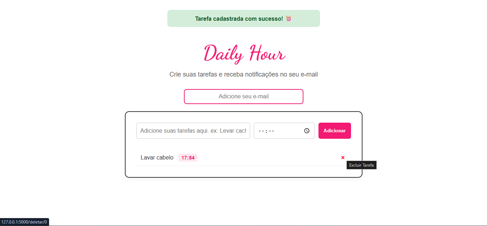

# ⏰ Daily Hour

O **Daily Hour** é uma aplicação web completa desenvolvida para ajudar usuários a organizarem suas rotinas através de lembretes agendados por e-mail. O sistema monitora o horário em segundo plano e envia notificações reais diretamente para a caixa de entrada cadastrada!

---

## 🚀 Funcionalidades

* **Cadastro de Tarefas:** Interface intuitiva para inserir nome da tarefa, e-mail de destino e horário do alerta.
* **Alertas Visuais dinâmicos:** Sistema de mensagens que confirma o sucesso do cadastro no topo da tela.
* **Monitoramento em Segundo Plano (Background Thread):** Um "relógio espião" em Python que roda paralelamente vigiando os horários minuto a minuto.
* **Disparo de E-mails Reais:** Integração profissional via protocolo SMTP com o servidor **Brevo** para entrega real de e-mails, mantendo credenciais e remetentes mascarados de forma segura.
* **Exclusão Avançada:** Opção de deletar tarefas diretamente da lista com um clique.

---

## 📸 Demonstração do Projeto

Aqui está o visual moderno e responsivo do sistema:

---

## 🛠️ Tecnologias Utilizadas

* **Python:** Inteligência e lógica do servidor.
* **Flask:** Framework web para rotas e requisições.
* **HTML5 & CSS3:** Estrutura e estilização moderna (Rosa Vibrante `#F21A72`).
* **SMTP / Brevo:** Infraestrutura profissional para o disparo automatizado de e-mails.
* **Threading (Python):** Processamento paralelo para o relógio em segundo plano.

---

## ⚙️ Como executar o projeto localmente

1. Clone o repositório.
2. Instale o Flask caso não tenha: `pip install flask`.
3. Configure suas chaves SMTP do Brevo no arquivo `app.py`.
4. Execute o arquivo principal: `python app.py`.
5. Acesse no navegador: `http://127.0.0.1:5000/`.
